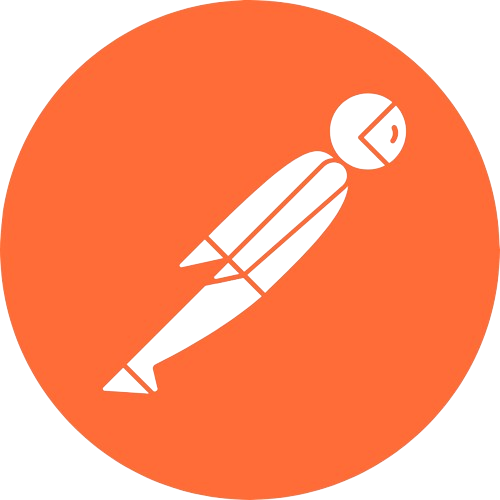

# Hi there 👋 my name is Pavlo, I am a Frontend Developer

## About Me

I am in the final stage of studying courses in the speciality of Full Stack Developer. I constantly learn and adapt to new technologies to stay abreast of the latest trends. Attentive to detail, organized, and diligent. Open to collaboration with other developers, designers, and project managers. The main technologies were studied: HTML, CSS, and JavaScript. I also gained knowledge and practical skills in working with UI/UX design at the Logos IT Academy courses, where the design of two layouts of web interfaces was implemented. My goal is to become a Frontend Architect in a well-known and successful company, earn a high income with flexible working hours, and have the opportunity to learn and develop. Specialize in certain areas, such as developing mobile applications to do only what I like, showing my creativity, creating unique and user-friendly interfaces, being involved in interesting projects, and working with modern technologies and tools.

## Experienc

I have been programming for a year. During the training period, I completed 2 team projects as a developer and 2 individual ones. Thanks to this, I successfully combine creativity and technical skills.

**Technologies:**

**Working with:**

**Learning:**

**Contacts:**

## Career Goals

🎯 My goal is to become a Frontend Architect in a well-known and successful company, earn a high income with flexible working hours, and have the opportunity to learn and develop. Specialize in certain areas, such as developing mobile applications to do only what I like, showing my creativity, creating unique and user-friendly interfaces, being involved in interesting projects, and working with modern technologies and tools.
